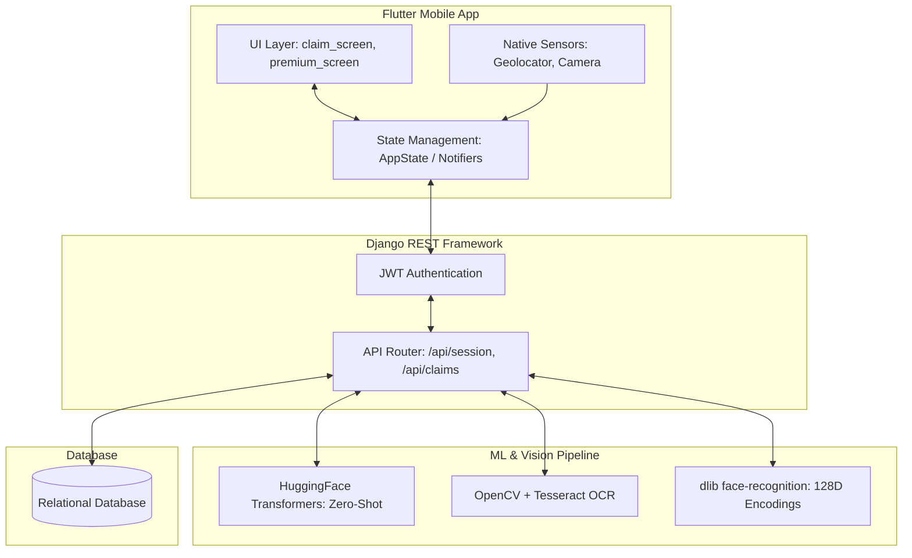

<div align="center">
  
  <h1>🛡️ GigShield 2.0 </h1>
  <p><b>AI-Powered, Real-Time Protection Architecture for the Modern Gig Workforce</b></p>
  <p><i>Verifying shifts, automating fair premiums, and validating claims through Machine Learning, OCR pipelines, and Multi-Signal Verification.</i></p>
</div>

---

## 🚀 The Vision: Why GigShield?

Gig workers run our modern cities. Yet, traditional insurance and protection plans fail them because they rely on slow processes, static pricing, and manual verification that does not fit a dynamic, gig-economy lifestyle. 

Gig workers need protection that is:
- **Instant to start** with minimal friction.
- **Fairly priced** taking real-world variables into account.
- **Smart enough** to validate claims automatically instead of days of manual processing.

**GigShield** is an intelligent, full-stack protection platform tailored for delivery partners. With GigShield, a quick selfie, an ID screenshot, and location data are all it takes to build a secure, dynamic, and verifiable safety net.

---

## 🧠 System Architecture & Data Flow

GigShield is built strictly utilizing a decoupled Event-Driven Architecture, separating the mobile client states from heavy backend Machine Learning processing.

### Architecture Diagram



---

## 🔬 Technical Deep Dive (For Hackathon Judges)

To give the judging panel maximum visibility into GigShield's engineering complexity, here is a granular breakdown of our technical pipelines and subsystems:

### 1. Identity Matrix & Continuous Face Verification Pipeline (`face-recognition`)
We prevent account sharing and identity spoofing using continuous deep-learning verification mapped against the initial Zomato ID signup snapshot.
- **Initialization:** At registration, `face-recognition` (built on DLIB's state-of-the-art face recognition network) maps the partner's face into a secure **128-dimension feature vector**.
- **Continuous Auth Loop:** During `Start Shift`, `Random Check`, and `End Shift` events, the backend processes incoming selfies. We extract the new face encoding and compute the Euclidean distance against the root vector. 
- **Tolerance Mapping:** We enforce a strict distance tolerance (`<= 0.6`). If `distance > 0.6`, the authentication fails, and the shift state is flagged and locked.

### 2. Algorithmic Auto-Claim Scoring Engine
Fraud is the highest cost center in insurance. GigShield turns days of manual investigation into a millisecond computation. The core is a weighted threshold algorithm merging realtime APIs with custom NLP logic:

- **`AI_SCORE_WEIGHT` (35%):** Claim descriptions are passed through local **HuggingFace Zero-Shot Classification pipelines**. The transformer model assigns probabilities matching risk labels `["accident", "road closure", "strike", "flood", "heavy traffic"]`. If probability > `0.80`, AI score spikes.
- **`WEATHER_SCORE_WEIGHT` (25%):** We trigger real-time regional weather APIs at the exact GPS coordinate of the claim, looking for precipitation anomalies and heatwave indicators.
- **`LOCATION_MATCH_WEIGHT` (20%):** A strict Haversine math calculation. If the claim is filed `>5km` from the rider's active tracking bounds, this weight plummets to `0`.
- **`ACTIVITY_DROP_WEIGHT` (20%):** An assessment of tracking telemetry—analyzing ping drops or erratic device speed leading up to the claim timestamp.

If `(AI*0.35 + Wx*0.25 + Loc*0.20 + Act*0.20) > APPROVAL_THRESHOLD (70%)`, the backend triggers automatic ledger payouts. Otherwise, it queues for manual audit or flags as `REJECTED_FRAUD`.

### 3. Computer Vision OCR Extraction Pipeline (Income Sync)
To calculate an intelligent premium, we need accurate, verifiable income stats. Rather than manual input, riders upload end-of-week Swiggy/Zomato screenshots. Mobile screenshots are inherently noisy, blurry, and feature dark-modes.
- **Image Preprocessing:** Backend uses **OpenCV** to normalize images. First, `cv2.cvtColor(image, cv2.COLOR_BGR2GRAY)`.
- **Interpolation & Resizing:** The matrix is scaled `fx=2, fy=2` via `cv2.INTER_LINEAR` to expand sub-pixel fonts.
- **Adaptive Thresholding:** `cv2.adaptiveThreshold` dynamically handles contrast problems across different screen brightnesses cleanly.
- **Extraction & Regex:** We push the cleaned matrix to **Pytesseract** (Tesseract OCR Engine). The raw text output is run against compiled Regular Expressions capturing `₹[0-9]+` and `[0-9]+ Rs` patterns to accurately sum weekly deliveries.

### 4. Adaptive ML Premium Calculation
Traditional insurance calculates flat rates based on Zip Code. GigShield uses live-computed risk weightings to calculate daily premiums dynamically.
- **Inputs:** Base region risk, rider category multiplier, weekly income baseline, total active hours, weekend vs weekday intensity ratios.
- **Adaptive Weight Learning:** Using historical data arrays mapped to specific regions, the app calculates how heavily weather or news events should skew the price (e.g., coastal regions index weather spikes harder). It enforces caps to avoid predatory pricing spikes and uses mathematical smoothing (Exponential Moving Averages) to bridge week-to-week changes evenly.

### 5. Frontend Polling & State Management
In Flutter, the `AppState` acts as a Single Source of Truth built on `ChangeNotifier`. To ensure users don’t have to manually refresh to see verified claims or premium updates, we utilize asynchronous background polling via `Timer.periodic`. This maintains real-time synchronization with the Django backend while efficiently managing app lifecycles (timers cleanly dispose when widgets are unmounted) ensuring zero memory leaks.

---

## 🛠️ The Technology Stack

GigShield is built utilizing a high-performance stack designed for robust separation of concerns, ML integration, and real-time app interactions.

| Component / Layer | Technology Used | Version/Library Focus |
| -------------- | --------------- | ------------------- |
| **Frontend UI** | Flutter, Dart | `Provider` state management, `Geolocator`, `ImagePicker` |
| **Backend Core** | Django, Django REST Framework | Django `6.0.3`, DRF `3.17.1` |
| **Authentication** | JWT (JSON Web Tokens) | `djangorestframework-simplejwt`, `PyJWT` |
| **AI & NLP** | HuggingFace Transformers | `transformers>=4.41.0`, Zero-Shot Classification |
| **Vision & OCR** | OpenCV, Pillow, Tesseract | `opencv-python>=4.8.0`, `pytesseract>=0.3.10` |
| **Face Sync** | dlib | `face-recognition>=1.3.5` |
| **Database** | SQLite (Demo) | Production ready for PostgreSQL / PostGIS |

---

## ⚙️ Core API Surface Map
Operates on an event-driven REST architecture perfectly built for high-throughput mobile clients:
- `POST /api/session/start/`: Computes GPS regions, starts telemetry, and verifies face encodings.
- `POST /api/session/random-check/`: Background handler for random mid-shift identity audit trails.
- `GET /api/session/history/`: Fetches ledger of OCR-normalized earnings and completed shift statuses.
- `GET /api/premium/summary/`: Invokes the algorithmic pricing weight model for location-adjusted premium stats.
- `POST /api/claims/submit/`: The algorithmic heavy lifter—triggers HuggingFace models, APIs, and executes the math payout function.

---

## 🚀 Getting Started (Installation & Setup)

Follow these step-by-step instructions to easily install and run the GigShield application locally.

### 1. Start the Django Backend Engine
Open your terminal and start the backend REST API:
```bash
# Navigate to the backend directory
cd gigshild

# Install all required Python libraries (Verified: requirements.txt contains all necessary packages)
pip install -r requirements.txt

# Run the Django development server
python manage.py runserver
```

### 2. Start the Flutter Web App
Open a new terminal and run the Flutter application using Chrome:
```bash
# Navigate to the Flutter app directory
cd gigshild_app

# Fetch the Flutter dependencies
flutter pub get

# Run the app locally on Chrome
flutter run -d chrome
```

### 3. Access the Dashboards (Web Tools)
To manage the platform and test live event triggers, we have mapped two important web utility files located in the `gigshild_app/web/` directory:
- **`fake_news_index.html`** - Open this file in your browser to trigger simulated fake news and test the automated claim validation engine.
- **`admin_dashboard.html`** - Open this file in your browser to view the admin dashboard panel and monitor real-time system activities.

---

## 📸 Demo Media (Google Drive)

All demo assets required to evaluate the GigShield system can be found in our shared Google Drive, including:
- **Photo Verification Images**
- **Demo Zomato IDs for OCR**
- **Demo Order History & Session Screenshots**

👉 **[https://drive.google.com/drive/u/0/folders/1aqMzJ0KxyQ8iEqEPrH06L_D2ZMS1GASs]**

---

## 📊 Pitch Deck

Our complete hackathon pitch deck is publicly accessible. It covers the problem statement, our solution architecture, and technical implementation details.

👉 **[https://docs.google.com/presentation/d/1pDiF8RnNKl1MMB8_zu_HiAdLK-A3_yIj/edit?slide=id.p10#slide=id.p10]**

---

## 🎥 Pitch Video

Watch our hackathon pitch video to see a complete live demonstration of our architecture and mobile app in action!

👉 **[https://youtu.be/ImL60Ah1OQM?si=3X5ZQFLPrVA6e7Er]**

---

<div align="center">
  <b>Built for the Gig Economy.</b>
</div>
